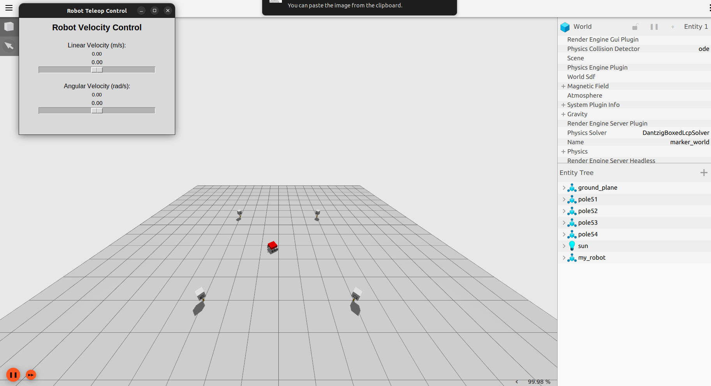
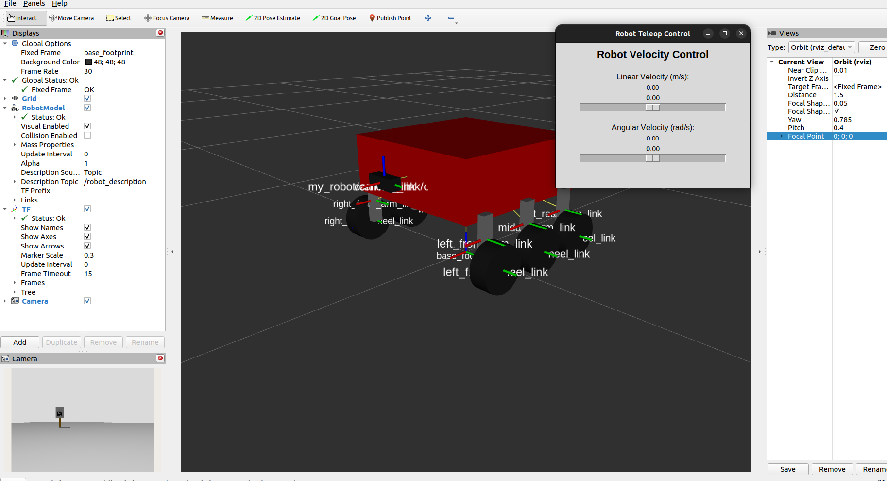
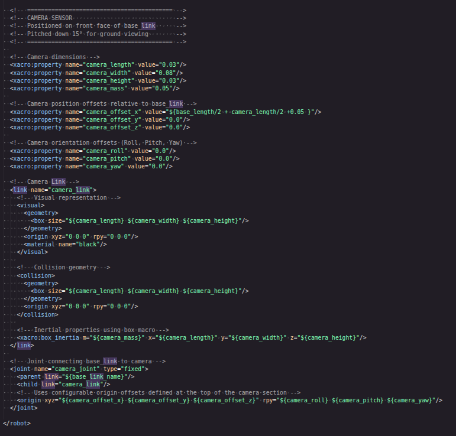
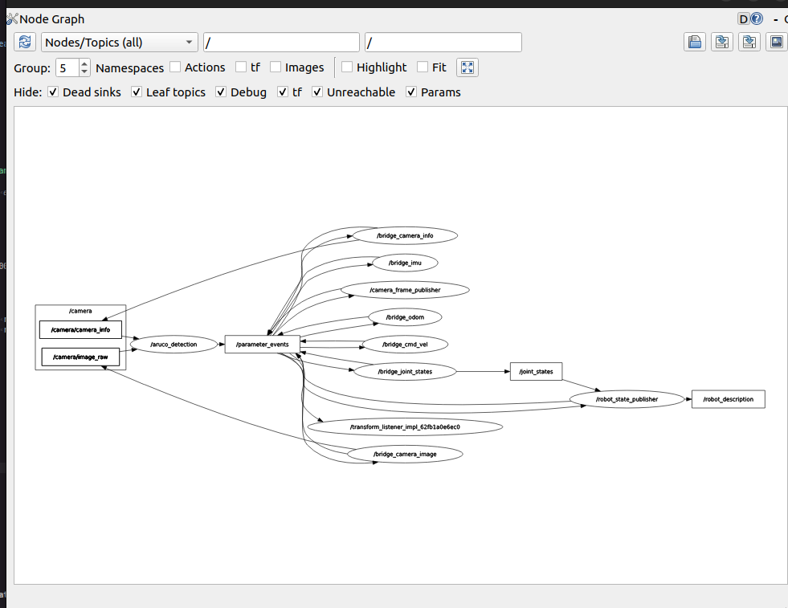

<h1 align="center">🚀 Mars Rover Simulation: ROS 2 & Gazebo Harmonic</h1>

<div align="center">
  
  
  
  
</div>

<br>

Welcome to the **Mars Rover Simulation**! This repository features a highly detailed, 6-wheeled differential-drive Mars rover developed for ROS 2 Humble and Gazebo Ignition. Designed to push the boundaries of robotic autonomy research, this simulation environment bridges complex kinematics with real-time perception for dynamic testing.

---

## ✨ Project Strengths & Highlights

- **Robust 6-Wheeled Kinematics:** Custom-engineered modular URDF/Xacro design delivering excellent differential drive stability over varying simulated terrains.
- **High-Fidelity Sensor Setup:** Integrating a 100 Hz IMU and 640×480 @ 30 Hz RGB camera, complete with physical noise and covariance modeling.
- **Automated Data Analytics:** Ships with custom Python tools (`imu_realtime_analyzer.py` and `plot_imu_data.py`) to validate statistical sensor noise over time.
- **Custom Teleoperation User-Interface:** Intuitive Python-based slider GUI for easy manual rover control, debugging, and command-velocity streaming.
- **Clean System Architecture:** Seamless bridging between ROS 2 and Gazebo with perfectly constructed TF trees and reliable data flow.

> **🙌 Special Acknowledgments:** 
> Both the **Python ArUco code detection** and the **ArUco marker 3D model poles** used in this project's custom simulation world were graciously adopted from the **ROAR ASU (Arizona State University)** program. We express our utmost gratitude for their framework and contributions!

---

## 📸 Gallery & Visualizer Outputs

| **Gazebo Simulation Environment** | **RViz2 Sensor Visualization** |
| :---: | :---: |
|  |  |
| *The Mars Rover navigating the 6m x 6m ArUco marker world.* | *Live camera feed, TF tree, and IMU data visualized in RViz.* |

| **Robot URDF Link Structure** | **ROS 2 Computation Graph (rqt_graph)** |
| :---: | :---: |
|  |  |
| *Detailed view of the 6-wheel suspension layout and joints.* | *Clean, modular ROS 2 node communications bridge.* |

---

## 🚀 Quick Start Guide

### 1. Build Workspace

```bash
cd ros2_ws
source /opt/ros/humble/setup.bash
colcon build
source install/setup.bash
```

### 2. Launch Simulation (Gazebo + Marker World)

```bash
# Empty World
ros2 launch my_robot_gazebo gazebo.launch.py

# Marker World (Recommended)
ros2 launch my_robot_gazebo spawn_robot.launch.py
```

### 3. Control Robot & View Sensors (New Terminals)

```bash
# Terminal 2: Launch teleop GUI
python3 src/robot_teleop_gui.py

# Terminal 3: View Camera feed
ros2 run rqt_image_view rqt_image_view
# Select topic: /camera/image_raw
```

---

## 📈 IMU Data Analysis

Analyze the rover's IMU characteristics in just 3 steps:

1. **Start simulation**: Launch the simulation world.
2. **Record IMU data** *(in a new terminal, run for 10-30s, then Ctrl+C)*:
   ```bash
   cd Scripts
   python3 imu_realtime_analyzer.py
   ```
3. **Generate analysis plots**:
   ```bash
   python3 plot_imu_data.py
   ```
   *Generates `imu_data.csv`, high-res 6-panel `imu_analysis.png`, and prints terminal statistical analysis (mean, std deviation).*

---

## 🏗 System Architecture

**Coordinate Frames:**
- `base_footprint` → `base_link` → `imu_link`, `camera_link`, 6 arms, 6 wheels

**Data Flow Pipeline:**
```text
Gazebo Sensors → ros_gz_bridge → ROS 2 Topics
  ├─ IMU      → /imu/data (100 Hz)
  ├─ Camera   → /camera/image_raw (30 Hz)
  │           → /camera/camera_info
  ├─ Odometry → /odom (50 Hz)
  └─ Control  ← /cmd_vel (teleop input)
```

**Version**: 1.0.0 | **Last Updated**: May 2026
